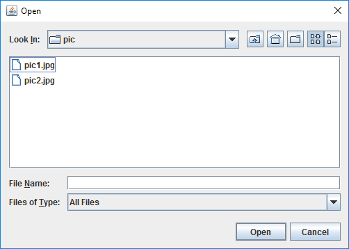
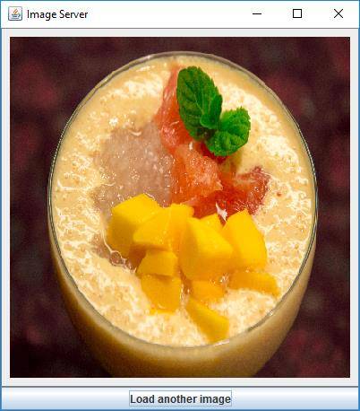
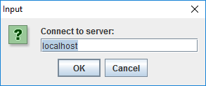
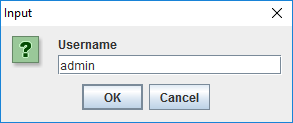
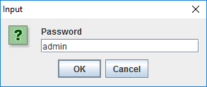
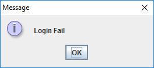
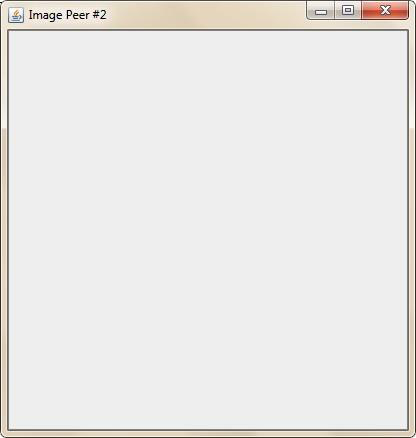
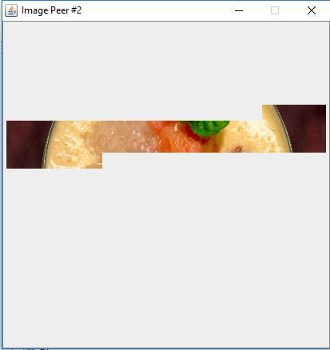
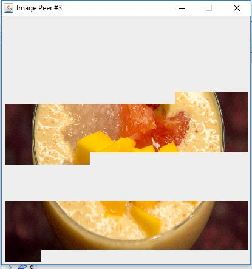
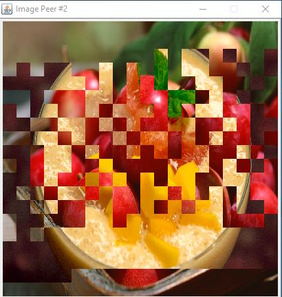

# Image Sharing System
It is a peer-to-peer (P2P) images sharing system with user authentication.

A hybrid P2P structure is used, where a server is used as the source of images as well as that of the list of peers available.

There are two main programs. ImageServer.java is the server program, and ImagePeer.java is the client (peer) program. A server will also act as a peer to share images.

## Server Interface
When ImageServer.class is executed, a file chooser is presented to ask for an image file.

If the image file fails to load, the program terminates. 

Otherwise, the server listens to the port 9000, and load the “User.txt” which contains the user information into the program and waiting for user to login.

The image is resized and scaled to fit into a canvas of 700*700 pixels in size. The button “Load another image” allows the user to change the current image. If the new image fails to load, the old image is retained.

## Peer program and authentication

When ImagePeer.java is executed, it should ask for the server’s IP address to be connected to. It then ask the peer user to login. 

For the user authentication, an authentication module is implemented.

The client uses the hash interface to hash the password before sending to the server and the server would verify the user information before start the main GUI. Hence, the server would also return the message if the user cannot login. (e.g. Account is locked)

Like the server, the canvas size in the peer is also 700*700 pixels.

Immediately after the GUI is shown, the peer will connect to the server and start to download the image from the server and other peers.

## P2P operation
Each peer performs the following:

1. Try to download blocks of image from the list of peers in simultaneously.

2. Accept connection from other peers and send out blocks of images other peers needed.

## Update image
The image will be updated if:

1. The user switches the image from the server program.

2. The user drag and drop the image block using the server program GUI.

## Example execution

When the first peer starts (after the server), it starts downloading blocks of image from the only peer (the server) available.

When the second peer starts, it starts downloading from the server peer (the bottom part) and the first peer (the middle part).

Notice that since the first peer is also downloading the blocks, the server is sending out blocks to the two peers in an alternating manner so that the first peer can download the other blocks from the second peer.

The first peer will also start download from the second peer.

When the user switches the image in the server, the peers which choose to update the image will download new blocks from the server and other peers.

## Other details
Client program will load default image.

json-simple-1.1.1.jar is used for reading and writing user records.

Peer activeness is checked every 10 second, by TimeoutException and ConnectionException.
 
